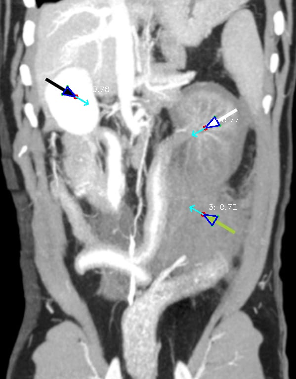

# Arrow Detection

Detects overlaid arrows in medical images and extracts their position, direction, and tip location.

Based on: "Overlaid Arrow Detection for Labeling Regions of Interest in Biomedical Images"
by K.C. Santosh et al., IEEE Intelligent Systems 2016

## Demo

### Success Case
All 3 arrows detected correctly:

| Input | Output |
|-------|--------|
|  |  |

### Failure Case
Arrow missed due to thin line and background complexity:

| Input | Output |
|-------|--------|
|  |  |

## Status

This geometric signature-based approach (based on Santosh et al., IEEE 2016) works on clean arrows but **does not perform consistently enough** on real-world medical images with varying arrow styles, occlusion, and background complexity.

A **YOLO-based detection method** will be implemented as a more robust alternative.

## Usage

```bash
# Single image
python detect-arrows.py image.jpg

# Directory of images
python detect-arrows.py ./images/

# Adjust threshold (lower = more detections, higher = stricter)
python detect-arrows.py image.jpg -t 0.65
```

## Options

| Option | Description |
|--------|-------------|
| `-t, --threshold` | Detection threshold (default: 0.7) |
| `-o, --output` | Output directory (default: ./results/) |
| `-q, --quiet` | Less verbose output |

## How It Works

1. Multi-level binarization extracts arrow candidates
2. Geometric analysis finds arrow vertices (tip + base points)
3. Signature matching compares shape to theoretical arrow model
4. Candidates above threshold are returned as detections

## Installation

```bash
pip install opencv-python numpy scipy matplotlib
```

## Files

- `detect-arrows.py` - CLI tool
- `pipeline.py` - Detection algorithm
- `debug_signatures.py` - Debugging visualization
